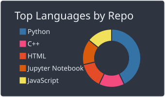
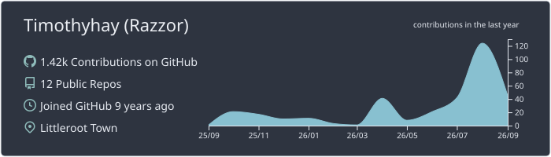

### Hi there! Razzor here! 🍃

- 💼 Now juggling R&D field LLM/Agent research.
- ✈️ **Wanderlust at heart!** Always daydreaming about my next travel destination 🌍
- 🧋 Powered by endless bubble tea, curiosity, and shoegazing music!
- 📘 Feel free to peek at my [Travel Journal](https://world.tangerinesoda.fun/) — it's low-key turned into my cozy digital secret base ✨

---

### What I'm playing with...

My daily work revolves around **LLM post-training** and building **collaborative agents** -

**Recent Focus:** `Agentic RL` • `On/Off-policy Distillation`

#### ⚡ LLM & Agent Infra
  

#### 🦖 Classic NLP & Foundations *(Back before LLM meant AI)*
  

#### 🧰 Other Tech Stack & Past Work
  

---

### Currently exploring ...

#### 🐋 WhalePod — Context Engineering for Long-Context Coding Agents

A research-oriented coding agent exploring context engineering for long-context models.

Instead of stuffing millions of tokens into prompts, WhalePod builds a stable context layer with:
- lightweight repo understanding
- context ledger for incremental retrieval
- prefix-cache aware architecture (**97%+ prefix cache hit rate** in real coding sessions)

Designed for DeepSeek-scale 1M context models and beyond. [Explore WhalePod →](https://github.com/Timothyhay/whale-pod)

---

### GitHub Activity 

After everything I've been through, still love writing code:

  
  

  

